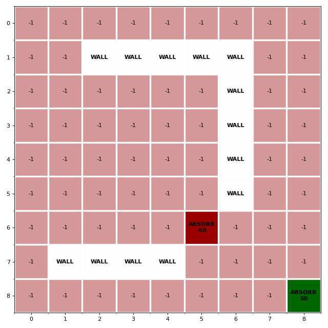
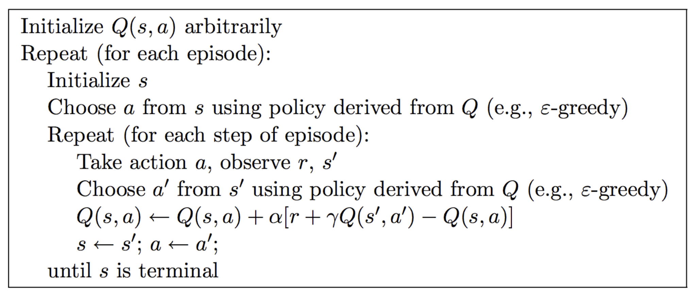
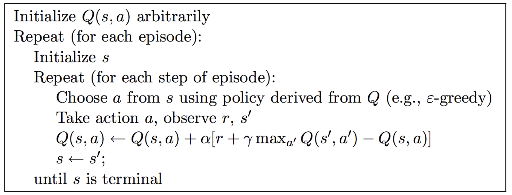
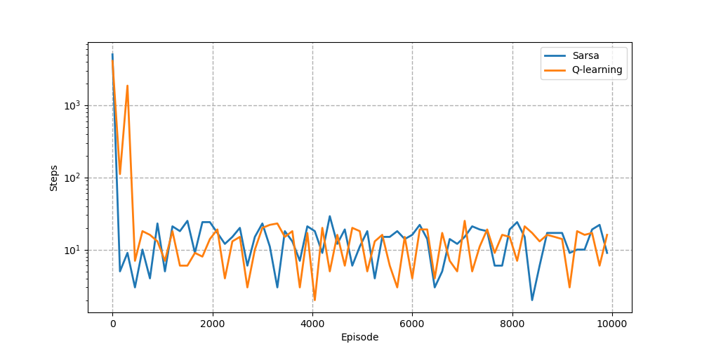
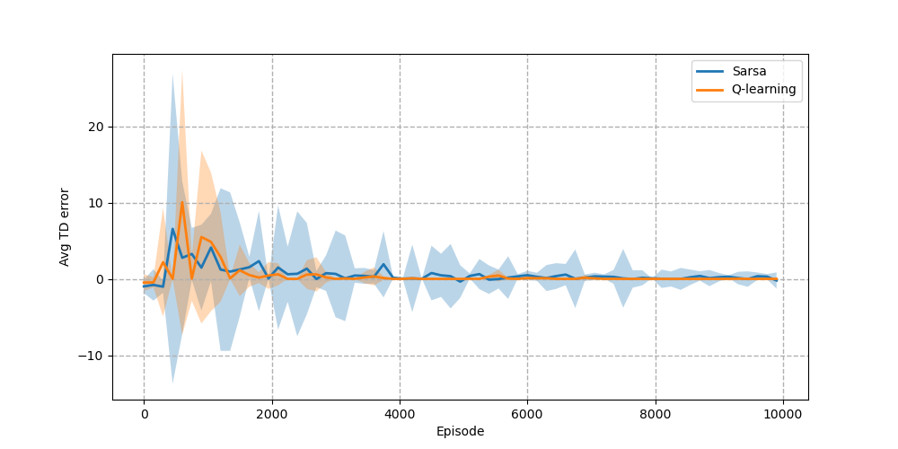

# :triangular_flag_on_post: Reinforcement Learning: SARSA and Q-Learning for Gridworld :checkered_flag:

This repository contains a code realized as part of the Multi-Agent System final exam of the Master's degree in Artificial Intelligence, Vrije Universiteit Amsterdam.

It aims to solve a **reinforcement learning** problem where, given a Gridworld of of size 9 × 9 represented in figure below, an agent should maximize the long-term reward moving around. The absorbing states in this environment are the cell in position *(6,5)* with a negative reward of -50 and the cell in position *(8,8)* with a negative reward of +50. Going in all other cells give a immediate reward of -1. It is not allowed for the agent to jump into a wall (white cells in the figure) or the grid-borders, so every action that leads there leaves the state unchanged.

In order to learn the optimal policy to follow, the agent have to act in the world to gain experience. In the next section I will discuss 3 solution for this model-free problem: Monte Carlo policy evaluation, SARSA and Q-learning.

## Environment representation

The encoding of the Gridworld is crucial to make the learning process faster and clearer. Therefore I defined the class `GridWorld`, that contain all the methods needed to manipulate the environment and the Monte Carlo evaluation, the Sarsa and the Q-Learning algorithm. The most important attributes of this class are:

  - *actions*: dictionary representing the correspondence between the
    index and the name of each action

        actions = {
                    0: 'UP',
                    1: 'RIGHT',
                    2: 'DOWN',
                    3: 'LEFT'
                }

  - *rewards*: 2D matrix 9 × 9 containing all the immediate rewards for
    each state

  - *transactions*: 3D matrix 9 × 9 × 4 where each cell represent the
    coordinate of the next state given by the deterministic transaction
    following the action specified by the layer

  - *policy*: 2D matrix 9 × 9 where each cell represent action given by
    the policy for the correspondent state

With this representation is straightforward to obtain the next state and the immediate reward during the generation of the episodes. At the start of the game, the Gridworld is initialized. Size, obstacles and terminal states positions must be given. At this point, the software will create an instance of Gridworld that will be used for each learning algorithm.

I defined also the class `Experience` for a compact representation of the learning experience. It contain in a unique object the 4 elements that express an experience: *state*, *action*, *reward*, *next state*.

## Monte Carlo policy evaluation

The Monte Carlo evaluation algorithm used to evaluate the policy is standard, no specific tricks have been taken and it has been implemented following the pseudocode in the Sutton & Barto book [[1]](1). The parameters were set as follows:

  - *number of episodes*: 10000. This number has been chosen, making different tries and searching for a good result and a relatively low number of episodes
    
  - *policy*: the policy ($\pi$) to evaluate is equiprobable, so each action have the same probability equal to $\frac{1}{4}$
    
  - *discount factor*: the discount factor is set to 1. In this way the agent should not mind about the non-terminal rewards, but instead it should aim at searching the final big prize of +50.

Theoretically we know that the value function converges asymptotically if every *(s,a)* is visited infinitely often. For this reason the solution implemented use the *exploring start* approach: before generating an episode, the starting state is chosen randomly between all states that are not terminal or obstacles. Moreover both first-visit MC and ever-visit MC methods are been implemented and one can select the version changing the value of the boolean parameter *every\_state* of the method `monte_carlo_equiprobable_policy_evaluation()`.

#### Results

The state value function $v_{\pi}(s)$ for the equiprobable policy $\pi$ calculated with the Monte Carlo policy evaluation after 10000 episodes is showed in figures below. The heatmap on the left and on the right are respectively the results obtained with the Monte Carlo evaluation first-visit and the Monte Carlo evaluation every-visit. We can observe that due to the equiprobable policy all the states near the bottom-right corner have an higher v-value with respect to the states in the top-left area since the latter are more likely to end up in the "snakepit" state (with a reward of -50).

From what is known in theory, these two algorithms converge both to $v_\pi(s)$ as the number of visits s goes to infinity. Hence, further experiments have been carried out. First, the number of episodes was increased to 100000. From this larger number, it is expected to get two identical maps. In fact, as possible to see in figure below, the two results are very close.

## SARSA + greedification to search for an optimal policy

In order to find the optimal policy, a 3D matrix of size 9 × 9 × 4 representing $q_{\pi}$ is initialized randomly and then two steps of
computation are combined:

  - greedification, meaning deriving the $\epsilon$-greedy policy that maximize the action value for each state $s=(i,j)$: with
    probability  $1-\epsilon$ the policy $\pi(s)=argmax_a \; q(s,a)$ and with probability \(\epsilon\) the policy \(\pi(s)\) is chosen randomly
    
  - the SARSA algorithm to evaluate the policy $\pi$ and improve the estimation of the state-action value function $q_{\pi}$

These 2 steps successively repeated enough allow to converge toward $q^*$ and $\pi_*$.

The update rule used by the SARSA algorithm is the following:
$$
q(s, a) \leftarrow q(s, a)+\alpha\left[r+\gamma q\left(s^{\prime}, a^{\prime}\right)-q(s, a)\right]
$$
The implementation of the method *sarsa\_algorithm* follow the pseudocode written below. As done for Monte Carlo policy evaluation, before generating the first experience *(s,a,r,s’,a’)* in each episode, the starting state *s* is chosen randomly between all states that are not terminal obstacles.

The parameters used for the method *sarsa\_algorithm* are listed below:

  - *discount\_factor*=1.0 (for the same reason explained in Monte Carlo policy evaluation)
    
  - *num\_episodes*=10000 (number of episodes to use for the training)

  - *epsilon*=0.2 (value for the \(\epsilon\)-greedy policy)

  - *alpha*=0.5 (value used for the learning rate)

From the theory it is well known that the SARSA algorithm converge to the optimal state-action value function with a learning rate $\alpha_t$ such that
$$
\sum_{t=1}^{\infty}\alpha_t = \infty \qquad \sum_{t=1}^{\infty}\alpha_t^2 < \infty
$$
So the actual learning rate that is used during the training will be $\frac{\alpha}{t}$ where $t$ is the step number in the episode. This allow to have an higher learning rate in the first stage of the training that will be gradually decreased.

#### Results

After estimating the $q^*$ values using SARSA algorithm, it is possible to obtain the greedy policy taking for each state the action
with the maximal state-action value function. Then it is straightforwardto compute the $v^*$ matrix using the Bellman equation:
$$
v^*(s) = max_a \; q^*(s,a)
$$
The obtained value function matrix with the optimal policy is showed in figure below. Apparently the results seems acceptable, but most likely it is not the real optimal policy since for instance in the state *(0,1)* make more sense to go right instead to go down.

## Q-learning to search for an optimal policy

The implementation of Q-learning algorithm used to search the optimal policy is standard and it follow the pseudocode written in figure below.

The method *q\_learning\_algorithm* has the same parameter of the method *sarsa\_algorithm* specified before, and the only differences on the algorithm are:

  - Q-learning estimate directly the optimal value function $q^*$ without a given policy $\pi$ to improve

  - the update rule for Q-learning is:  
    $$
    q\left(s, a\right) \leftarrow q\left(s, a\right)+\alpha\left[r+\gamma \max _{a'} q\left(s', a'\right)-q\left(s, a\right)\right]
    $$

#### Results

As done for the results of SARSA, once computing the optimal state-action value function, the optimal policy and the optimal state value function matrix are computed afterwards.

The obtained \(v^*\) matrix with the optimal policy is showed in figure below. This result is definitely more reliable than the previous one and it is easy to check on the Gridworld that each value function is exactly the total reward following the shortest path to reach the "treasure" absorbing state.

## Comparison SARSA vs Q-learning

In order to compare the two model-free algorithms implemented, some statistics are been collected during the learning.

During the execution of both SARSA and Q-learning it is observable that the first episodes are slower to compute, but after few hundred iterations the algorithms became faster and faster giving the solution in less than 15 seconds. This behavior could be understood looking to the figure below, that shows the length of each episode during the learning until reaching an absorbing state. In the fist stage, the episodes are very long since the policy is derived from a random initialized $q_{\pi}$ and the agent spend a lot of time moving randomly in the Gridworld. But after some episodes the policy start converging toward the optimal one, so for the agent is easier to reach an absorbing state. Moreover the Q-learning algorithm seems to take more time in the first stage because it is off-policy and require more exploration to find the right path.

Another observation could be done about the speed of convergence of both algorithms. For each episode, the Temporal Differencing error (TD) in each step was computed and the figure below shows the average and the standard deviation along the training. For both algorithm it oscillates more in the first episodes and than goes closer to 0 in the last episodes. But observing the standard deviation, seems that the Q-learning algorithm converge faster than SARSA. This helps to explain why the results obtained by Q-learning are more accurate.

## References
[1] Richard  S.  Sutton  and  Andrew  G.  Barto. ReinforcementLearning: An Introduction. Second. The MIT Press, 2018. URL: [http://incompleteideas.net/book/the-book-2nd.html](http://incompleteideas.net/book/the-book-2nd.html)
